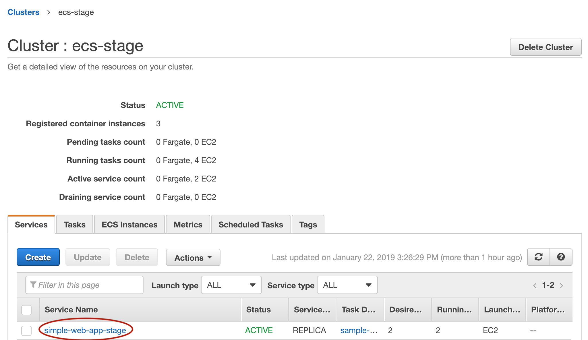
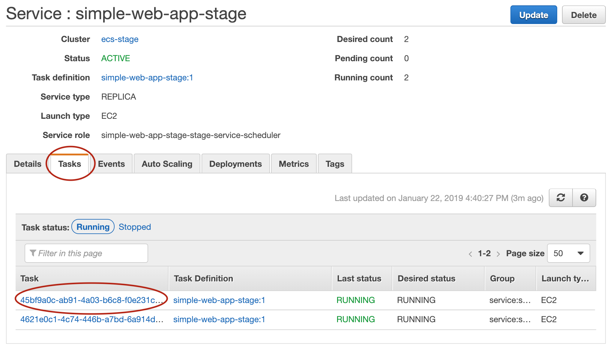
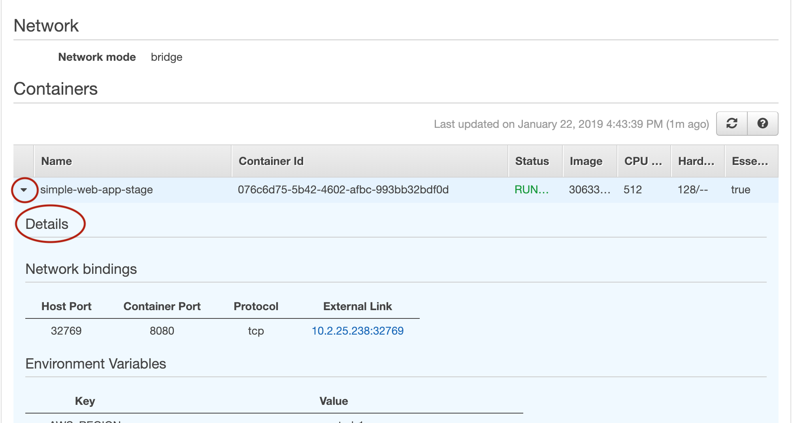
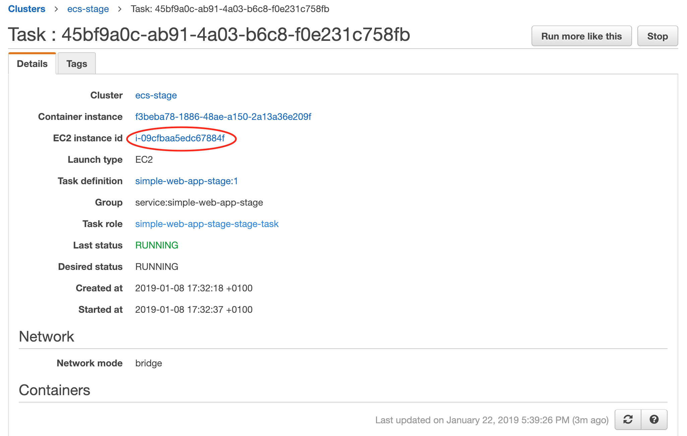
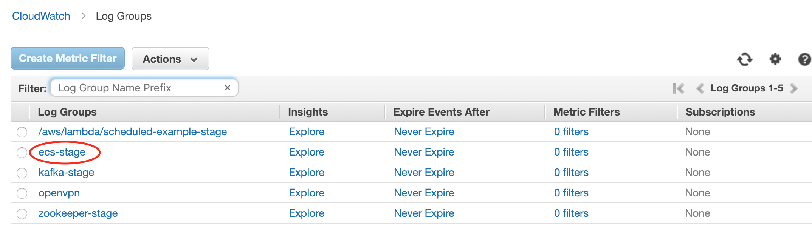
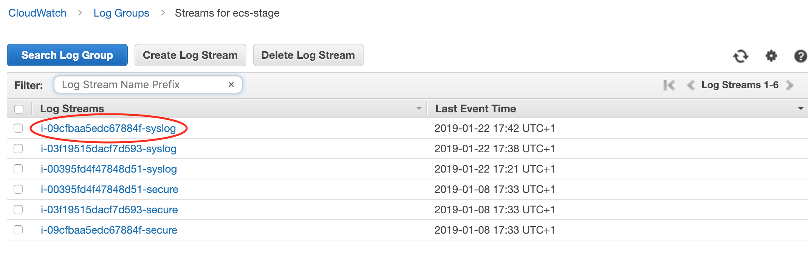
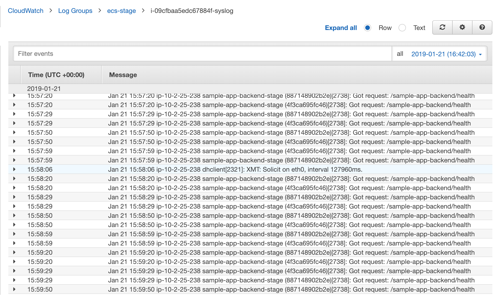

# How To Deploy A Docker Service

This guide walks you through deploying a dockerized app to the ECS cluster running in your Reference Architecture in AWS.

* [The App](#the-app)
* [Dockerizing](#dockerizing)
* [Publishing your docker image](#publishing-your-docker-image)
* [Deploying to a cluster](#deploying-to-a-cluster)
  * [ECS Task Configuration](#ecs-task-configuration)
  * [Application Load Balancer Configuration](#application-load-balancer-configuration)
* [Debugging errors](#debugging-errors)
  * [ECS Console](#ecs-console)
  * [CloudWatch Logs](#cloudwatch-logs)
* [Customizing](#customizing)
  * [Updating the module](#updating-the-module)
  * [Creating spin-off services](#creating-spin-off-services)

## The App

Let's say you have an app that you want to deploy. For this guide, we'll use a simple Node.js app as an example, but the same principles can be applied to any app:

```js
const express = require('express');

// Constants
const PORT = 8080;
const HOST = '0.0.0.0';

// App
const app = express();
app.get('/simple-web-app', (req, res) => {
  res.send('Hello world\n');
});

app.listen(PORT, HOST);
console.log(`Running on http://${HOST}:${PORT}`);
```

That's it! It's a classic express "Hello World" starter app that listens for requests on port `8080`. For this example
walkthrough, save this file as `server.js`.

Since we need to pull in the dependencies to run this app, we will also need a corresponding `package.json`:

```js
{
  "name": "docker_web_app",
  "version": "1.0.0",
  "main": "server.js",
  "scripts": {
    "start": "node server.js"
  },
  "dependencies": {
    "express": "^4.16.1"
  }
}
```

## Dockerizing

In order to deploy the app on ECS, we need to dockerize the app. If you are not familiar with the basics of docker, we recommend you check out our "Crash Course on Docker and Packer" from the [Gruntwork Training Library](https://training.gruntwork.io/p/a-crash-course-on-docker-packer).

For this guide, we will use the following Dockerfile to package our app into a container.

```
FROM node:8

# Create app directory
WORKDIR /usr/app

COPY package*.json ./

RUN npm install
COPY . .

EXPOSE 8080
CMD [ "npm", "start" ]
```

The folder structure of our sample app looks like this:

```shell
├── server.js
├── Dockerfile
└── package.json
```

Your actual app will definitely be way more complicated than this but the main point to take from here, is that we need to ensure our docker image is configured to EXPOSE the port that our app is going to need for external communication. See [examples](https://docs.docker.com/samples/) of how to dockerize many popular app formats.

To build this a docker image from the Dockerfile, run:

```bash
$ docker build -t simple-web-app:latest .
```

Now we can test our container to see if it is working:

```bash
$ docker run --rm -p 8080:8080 simple-web-app:latest
```

This starts the newly built container and links port `8080` on your machine to the container's port `8080`. You should
see output like below when you run this command:

```
> docker_web_app@1.0.0 start /usr/app
> node server.js

Running on http://0.0.0.0:8080
```

You should now be able to hit the app by opening `localhost:8080` in your browser. Try it out to verify you get the
"Hello world" message from the server.

Some things to note when writing up your Dockerfile and building your app:

* Ensure your Dockerfile starts your app in the foreground so the container doesn't shutdown after app startup.
* Your app should log to stdout/stderr to aid in [debugging](#debugging-errors) it after deployment to AWS

## Publishing your docker image

Once you've verified that you can build your app's docker image without any errors, the next step is to publish those images to an ECR repo. The ECR repos exists in your `shared-services` account.

Go to this [file](https://github.com/alliedworld/infrastructure-live/tree/master/shared-services/us-east-1/_global/ecr-repos/terragrunt.hcl) and add the desired repository name of your app to the `repo_names` list. For the purposes of our example, let's call ours `simple-web-app`. Next, [authenticate](08-accounts-and-auth.md) to the `shared-services` account and run the following command:

```bash
$ terragrunt apply
```

The command should create an ECR repo with the name you specified in the `shared-services` account. Each repo in ECR has a URL of the format `<ACCOUNT_ID>.dkr.ecr.<REGION>.amazonaws.com/<REPO_NAME>`. So for the `shared-services` account with ID 451511469926, an ECR repo in us-east-1, and an app called `simple-web-app`, you can publish your local docker image to the newly created repo as follows:

```bash
$ docker tag simple-web-app:latest 451511469926.dkr.ecr.us-east-1.amazonaws.com/simple-web-app
```

Finally, authenticate your docker client with Amazon ECR

```bash
eval $(aws ecr get-login --region "us-east-1" --no-include-email --registry-ids "451511469926")
```

and push your newly tagged image to publish it:

```bash
$ docker push 451511469926.dkr.ecr.us-east-1.amazonaws.com/simple-web-app
```

## Deploying to a cluster

Now that you have the docker image of your app published, the next step is to deploy it to your ECS Cluster that was set up as part of your reference architecture deployment.

The first step is to create a folder with your app name in the `services` folder for each of your environments (i.e. dev, stage, prod) in [infrastructure-live](https://github.com/alliedworld/infrastructure-live). For example, for the `stage` environment, we'd create a `simple-web-app` folder under [stage/us-east-1/stage/services](https://github.com/alliedworld/infrastructure-live/tree/master/stage/us-east-1/stage/services). Next, you can copy over the contents of the [sample-app terragrunt.hcl](https://github.com/alliedworld/infrastructure-live/tree/master/stage/us-east-1/stage/services/sample-app-frontend) so we have something to start with.

```bash
$ cp -r ~/source/infrastructure-live/stage/us-east-1/stage/services/sample-app-frontend ~/source/infrastructure-live/stage/us-east-1/stage/services/simple-web-app
```

Still in the `simple-web-app` folder, open the `terragrunt.hcl` file and update the following parameters:

### ECS Task Configuration

* Set `service_name` to your desired name. In our case we'll just set it to `simple-web-app-{env}`. Where `{env}` is the environment we're currently in.
* Set `image` to the repo url of the just published docker image. In our case, `451511469926.dkr.ecr.us-east-1.amazonaws.com/simple-web-app`
* Set `desired_number_of_tasks` to the number of tasks of your app you want ECS to spawn. Let's set ours to `2`.
* Set `container_port` to the port your container exposes. In our case, `8080`.


### Application Load Balancer Configuration

When deployed, the actual containers are run on an ECS cluster which is basically a bunch of EC2 instances. We use an Application Load Balancer to route requests among those EC2 instances. Luckily, all these already come set up with the Reference Architecture. All that's left for you, is to define the routing rules specific to your app.

In our case, while our app listens on port `8080`, we'd like our users to be able to visit it via a regular web browser without having specify a port (you know, like normal people do). To achieve that, we update the `alb_listener_rule_configs` parameter to:

```hcl
alb_listener_rule_configs = [
  {
    port     = 80,
    path     = "/simple-web-app*",
    priority = 100
  },
]
```

What the above will do is to forward all requests to the load balancer on port `80` to our app running in the container on the port we defined in `container_port`, which is `8080`. The load balancer is used to route requests to a ECS Services deployed on that cluster, so you need to set the `path` on the load balancer DNS that should route to your app - i.e. `http://{load_balancer_dns}/{path}`. In our case, we set it to `/simple-web-app`, but you can imagine how you'd have a `/admin` to route to your admin app and a `/tracking` to a tracking app.

Since you already have TLS certs cofigured for the domains you use with your load balancer, so you should add a config for port `443` to support `HTTPS` access.

```hcl
alb_listener_rule_configs = [
  {
    port     = 80,
    path     = "/simple-web-app*",
    priority = 100
  },
  {
    port     = 443,
    path     = "/simple-web-app*",
    priority = 100
  },
]
```

The `alb_target_group_protocol` parameter is used to determine the protocol the load balancer uses to forward requests to your app. This defaults to `HTTP` and is probably fine for most cases. The only other option is `HTTPS` and you'd need to ensure your app can process requests coming in via `HTTPS`. The TLS certs registered for your domain names are issued by Amazon Certificate Manager (ACM) for `HTTPS` connections from browsers to the load balancer. For `HTTPS` requests from your load balancer to your app, you'd need to use the [self-signed certificates](https://github.com/alliedworld/sample-app-frontend#tls-certs) for that.

There are two ALBs deployed with the Reference Architecture,

1. A public one that runs in the public subnets, is accessible from the public Internet, has a domain name pointing at it, and certs from ACM. This one is meant for routing traffic from the outside world to your "frontend" apps.
1. An internal one that runs in the private app subnets, is only accessible from within the VPC, has an internal domain name (Route 53 private hosted zone) associated with it, and might have self-signed certs. This one is meant for routing traffic from your internal apps ("backends") to other internal apps.

`is_internal_alb` tells us which load balancer to use. You should set it to true for "backends" that should only be accessible from within the VPC and false for "frontends" that should be accessible from the public Internet.

Finally, set `health_check_path` to a path on the url of your app that performs health checks. This can be any endpoint that returns a `200` response code when issued a `GET/` request or one that does some fancy health checking under the hood. We can stick with the base path `/simple-web-app` in our case. The load balancer will not forward requests to your app if it doesn't pass health checks.

Our resulting `terragrunt.hcl` should look something like this:

```hcl
# (the terragrunt config portion of the file is omitted for brevity; you can copy it from the sample apps)

inputs = {
  service_name = "simple-web-app-stage"
  image = "451511469926.dkr.ecr.us-east-1.amazonaws.com/simple-web-app"

  # This parameter must match the tag of the published image
  version = "latest"

  desired_number_of_tasks = 2
  cpu = 512
  memory = 128

  container_port = 8080

  alb_listener_rule_configs = [
    {
      port     = 80,
      path     = "/simple-web-app*",
      priority = 100
    },
    {
      port     = 443,
      path     = "/simple-web-app*",
      priority = 100
    },
  ]

  alb_target_group_protocol = "HTTP"
  is_internal_alb = false
  health_check_path = "/"
  health_check_protocol = "HTTP"

  # Trigger an alarm if CPU usage is over 90 percent during a 5 minute period
  high_cpu_utilization_threshold = 90
  high_cpu_utilization_period = 300

  # Trigger an alarm if memory usage is over 90 percent during a 5 minute period
  high_memory_utilization_threshold = 90
  high_memory_utilization_period = 300
}
```

You can take a look [here](https://github.com/alliedworld/infrastructure-modules/tree/master/services/ecs-service-with-alb/variables.tf) for more options. Once you've verified that everything looks fine, to deploy your app, simply run:

```bash
$ terragrunt apply
```

If everything went fine, we should be able to reach our app at https://aw-stage.cloud/simple-web-app.

## Debugging errors

Sometimes, things don't always go as planned. And when that happens, it's always beneficial to know how to locate the source of the problem. There are two ways to debug a failed ECS Task

### ECS Console

This approach is ideal for debugging situations in which the container refuses to start. Here's how we'll debug our simple-web-app using the ECS Console.

1. First we go to the [ECS Console](https://console.aws.amazon.com/ecs/), login to the account you're debugging (e.g., the stage account), and click on the `ecs-stage` cluster. Ensure you're in the region you deployed your service to.

1. In the services tab, we see a list of services deployed in that cluster. Click on your service (`simple-web-app`).

    

1. We are presented with information about the `simple-web-app` service. Clicking on the `Tasks` tab shows us the different task instances of our app. Usually, you'd be debugging a task that failed to start so you should switch `Task status:` over to `stopped`. The "Events" tab shows the most recent events with container deployments, redeploys, etc. That's a good place to look, to see if your cluster is out of capacity.

    

1. Clicking on the task we want to debug takes us to a page that shows us details about that task. Scroll down to see information about the container. Expand the container information by clicking on the arrow next to the container name, information regarding why the container refused to start will be in the `Details` section.

    

### CloudWatch Logs

By default, stdout and stderr from your ECS Service is sent to CloudWatch logs. This is ideal for debugging situations where the container starts successfully but the service doesn't work as expected. Let's assume our `simple-web-app` containers started successfully (which they did!) but for some reason our requests to those containers are timing out or returning wrong content.

1. Repeat the steps in [ECS Console](#ecs-console) to get to the task info page and take note of the "EC2 Instance id"

    

1. Go to the "Logs" section of the [Cloudwatch Management Console](https://console.aws.amazon.com/cloudwatch/) and look for the name of the ECS cluster in the table. In our case, it's `ecs-stage`

    

1. Clicking it should take you to a new page that displays a table containing EC2 instances ids. Look for the instance id we noted in Step 1.

    

1. You should be presented with a real-time log stream of the container. If your app logs to STDOUT or syslog, its logs will show up here. You can export the logs and analyze it in your preferred tool or use [CloudWatch Log Insights](https://docs.aws.amazon.com/AmazonCloudWatch/latest/logs/AnalyzingLogData.html) to query the logs directly in the AWS web console.

    

## Customizing

The Reference Architecture, tries to cater to common use cases. However, sometimes you might find that you'd like to do things a little differently. Luckily, you own the code and you're free to customize this as you see fit.

### Updating the module

Sometimes you'd want to use new or existing features that the module doesn't support. In such cases, you can get by by simply updating the [module](https://github.com/alliedworld/infrastructure-modules/tree/master/services/ecs-service-with-alb) to your taste.

For example, you might want to use host-based routing instead of path-based routing i.e. your want our app to be deployed to a sub-domain, `https://<your-app-name>.aw-stage.cloud` instead of `https://aw-stage.cloud/<your-app-name>`. To achieve this; follow the following steps:

1. Go to the module's [main file](https://github.com/alliedworld/infrastructure-modules/blob/master/services/ecs-service-with-alb/main.tf) and update the `aws_alb_listener_rule` resource to the following:

    ```hcl
    resource "aws_alb_listener_rule" "paths_to_route_to_this_service" {
      count        = "${length(var.alb_listener_rule_configs)}"
      listener_arn = "${lookup(data.terraform_remote_state.alb.listener_arns, lookup(var.alb_listener_rule_configs[count.index], "port"))}"
      priority     = "${lookup(var.alb_listener_rule_configs[count.index], "priority")}"

      action {
        type             = "forward"
        target_group_arn = "${module.ecs_service.target_group_arn}"
      }

      condition {
        field  = "host-header"
        values = ["${lookup(var.alb_listener_rule_configs[count.index], "host")}"]
      }
    }
    ```

    In this example, we simply change the `field` param of the `condition` block to `host-header` and update the look-up key in the `values` param to `host`.

1. Next, you simply update the `alb_listener_rule_configs` in the terragrunt.hcl file of your app. In our case:

    ```hcl
    alb_listener_rule_configs = [
      {
        port     = 80,
        host     = "simple-web-app.aw-stage.cloud",
        priority = 100
      },
      {
        port     = 443,
        host     = "simple-web-app.aw-stage.cloud",
        priority = 100
      },
    ]
    ```

1. Finally, run:

    ```bash
    $ terragrunt apply
    ```

and we should now be able to access our simple app by visiting https://simple-web-app.aw-stage.cloud instead of https://aw-stage.cloud/simple-web-app.

See [thi guide](05-ci-cd.md) for instructions on how to roll-out infrastructure changes.

### Creating spin-off services

Other times you find that you want to get a bit more involved. For example, you might want to deploy two different apps that are a different enough to make it hard to use the single [module](https://github.com/alliedworld/infrastructure-modules/tree/master/services/ecs-service-with-alb). In this case, you simply add two new modules [here](https://github.com/alliedworld/infrastructure-modules/tree/master/services) that wrap the `ecs-service-with-alb` module and extend it with the additional functionality you need. You can then follow the directions earlier in this doc to create and deploy an app that relies on those modules.

For example, you need a module with support for host-based routing but you still want to keep `ecs-service-alb` around for path-based routing. Let's call this service foo.

```hcl
module "foo_service" {
  source = "../ecs-service-with-alb"

  # Set this variable to ensure no path-based rule is set
  alb_listener_rule_configs = []

  # Set other params specific to service foo here
}

# Add foo specific listener rule resource
resource "aws_alb_listener_rule" "host_to_route_to_this_service" {
  # Add configuration for host-based routing
}

# You can add other resources specific to service foo here
```


## Next steps

Next up, you'll learn how to [migrate your apps to the Reference Architecture](11-migration.md).
